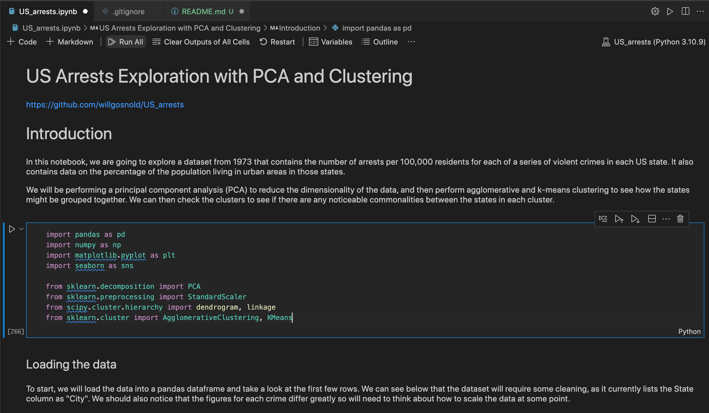

# US Arrests Exploration with PCA and Clustering

### Summary

This project is an exploration of the 1973 US arrests dataset, in which details are given of violent crimes and urban population percentages for each of the 50 US states. The aim of the project is to explore the data and to use PCA and clustering to identify groups of states with similar characteristics. The project is primarily a python jupyter notebook.

### Contents

- [Installation](#Installation)
- [Usage](#Usage)
- [Credits](#Credits)

### Installation

This project requires Python 3.6 or greater and the following Python libraries installed:

- [NumPy](http://www.numpy.org/)
- [Pandas](http://pandas.pydata.org)
- [Scikit-learn](http://scikit-learn.org/stable/)
- [matplotlib](http://matplotlib.org/)
- [seaborn](https://seaborn.pydata.org/)
- [scipy](https://www.scipy.org/)

### Usage

To run the project, open the jupyter notebook `US_arrests.ipynb` and run the cells in order. The notebook is well commented and should be self-explanatory. 

### Credits

This project was completed as part of the [Hyperion Dev Data Science Bootcamp](https://www.hyperiondev.com/bootcamps/data-science-bootcamp/). The source of the original dataset is unknown. 